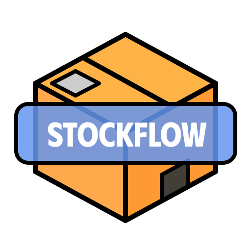

 

    
    <h1>StockFlow</h1>  
    
Система анализа и моделирования запасов

     

StockFlow помогает подбирать оптимальные параметры управления запасами:  
объем поставки, порог срабатывания заказа и период доставки — на основе реальных данных о расходе и остатках.

### Текущая версия

**v0.1.2** (февраль 2026)

- Полноценный анализ и моделирование складских запасов
- Поддержка Windows, macOS (Apple Silicon & Intel)
- Экспорт результатов в Excel
- Автоматический расчет рекомендуемого порога

### Возможности

- Анализ исторических данных по остаткам, приходу и расходу
- Автоматический расчет **рекомендуемого порога** на основе модели спроса
- Визуализация: сравнение моделируемых и фактических данных
- Поддержка загрузки данных из Excel (.xlsx, .xls), CSV (.csv)
- Экспорт результатов в Excel с форматированием
- Кроссплатформенное приложение (Windows, macOS, Linux)
-️ Офлайн-работа — данные не покидают ваш компьютер

### Экспорт

Результаты можно сохранить в Excel-файл с колонками:

- Номенклатура
- Поставка
- Порог
- Дней доставки
- Цена
- Эффективность (%)
- Средний остаток (модель / факт)

### Поддерживаемые платформы

- Windows (.msi)
- macOS (.dmg, Apple Silicon & Intel)

### Поддержка

Нашли баг? Хотите предложить улучшение?  
→ Откройте [Issue](https://github.com/yungsmau/StockFlow/issues  )  
→ Или отправьте Pull Request!
